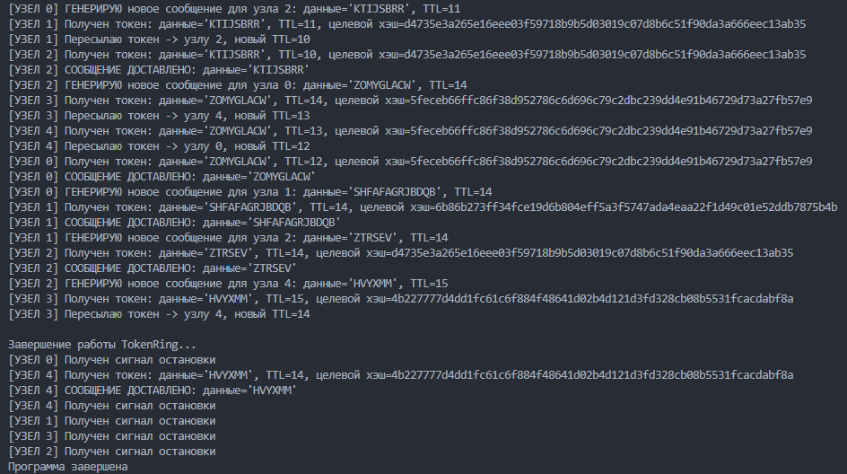

# TokenRing Emulator

Простой эмулятор протокола TokenRing на Go. Узлы (горутины) соединены в кольцо и передают сообщения с TTL до получателя.

## Описание

Каждый узел имеет ID, соединен каналами с соседями, проверяет хэш получателя (SHA256) и уменьшает TTL при пересылке.

## Параметры запуска

| Флаг   | Описание                       | Значение по умолчанию |
| ---------- | -------------------------------------- | ---------------------------------------- |
| `-nodes` | Количество узлов        | 5                                        |
| `-time`  | Время работы (секунд) | 10                                       |

## Примеры запуска

```bash
# Запуск с 5 узлами на 10 секунд
go run tokenring.go

# Запуск с 8 узлами
go run tokenring.go -nodes=8

# Запуск с 3 узлами на 20 секунд
go run tokenring.go -nodes=3 -time=20
```

## Пример запуска:


